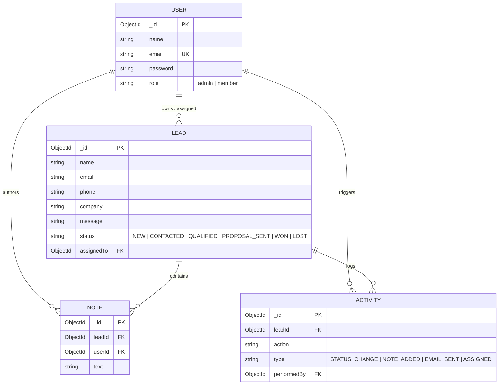

# Project: Sales-Lead (HeroCRM)

## Vision & Overview
Sales-Lead (HeroCRM) is a full-stack MERN CRM application designed for modern sales teams to capture leads, track customer interaction lifecycles, collaborate via notes, and monitor conversion pipelines.

The current codebase features a public lead capture landing page, JWT-authenticated dashboard with Role-Based Access Control (Admin vs. Member), lead lifecycle management across six pipeline stages, and an activity audit log.

This onboarding milestone incorporates three major upgrades specified in `.planning/codebase/INTEGRATION.md`:
1. **Outbound Email Integration & Activity Logging**: Direct emailing to leads with branded templates and automated activity tracking.
2. **Analytics & Reporting Dashboard**: Aggregation-backed conversion funnels, stage drop-offs, team member performance, and historical timeseries metrics.
3. **Real-Time Collaboration via WebSockets**: Instant updates across client sessions for status changes, notes, assignments, and live notifications.

---

## Architecture & Tech Stack

| Layer | Technologies | Key Files |
|---|---|---|
| **Backend Runtime** | Node.js (CommonJS), Express 5.2.1 | `server/src/index.js` |
| **Database & ODM** | MongoDB, Mongoose 9.8.0 | `server/src/config/db.js`, `server/src/models/` |
| **Security & Auth** | JWT (`jsonwebtoken` 9.0.3), `bcryptjs` 3.0.3, CORS | `server/src/middleware/authMiddleware.js`, `utils/jwt.js` |
| **Validation** | Zod 4.4.3 | `server/src/validations/` |
| **Frontend Framework** | React 19.2.7, Vite 8.1.1, React Router 7.18.1 | `client/src/App.jsx`, `client/src/main.jsx` |
| **Styling** | Custom Design Tokens (`App.css`), Tailwind CSS v4 | `client/src/App.css`, `client/src/index.css` |
| **HTTP Client** | Axios 1.18.1 with JWT interceptors | `client/src/api/axios.js` |
| **Planned Dependencies**| `nodemailer` (email), `socket.io` & `socket.io-client` (websockets), `recharts` (analytics charts) | |

---

## Core Domain Entities

---

## Key Constraints & Operational Rules

1. **Security**: Never expose real secrets in documentation; store secrets strictly in `.env`.
2. **Access Control**:
   - `admin`: Full access to all leads, assignment, deletion, and analytics.
   - `member`: Restricted to assigned/owned leads; can update status, add notes, and send emails; cannot delete or reassign.
3. **Resilience**:
   - Email failure must return 400/502 without crashing the server or creating phantom activity documents.
   - WebSocket connection failure must degrade gracefully to REST polling without breaking core CRM operations.
   - MongoDB aggregations must be indexed and executed server-side.
