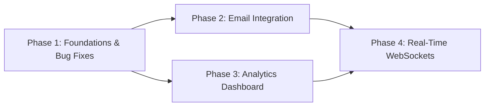

# Development Roadmap

## Milestone: Sales-Lead 2.0 (Email, Analytics & Real-Time)

This roadmap sequences the four core implementation phases for upgrading Sales-Lead from a basic CRUD CRM into a production-grade collaboration platform.

---

## Phase 1: Foundations & Core Bug Fixes
**Goal**: Resolve existing security leaks, runtime bugs, and architectural gaps that could compromise new feature development.

### Requirements Addressed
- `FND-01`: Credential sanitization in `DEPLOYMENT.md`
- `FND-02`: Fix `req.userId` in `/api/auth/me`
- `FND-03`: Fix Axios 403 interceptor session purge
- `FND-04`: Include `PROPOSAL_SENT` in dashboard status counts
- `FND-05`: Add `GET /api/users` endpoint for member selection
- `FND-06`: Align `Activity` model schema with structured types

### Key Files
- `DEPLOYMENT.md`
- `server/src/controllers/authController.js`
- `server/src/services/dashboardService.js`
- `server/src/models/Activity.js`
- `server/src/routes/authRoutes.js` / new `userRoutes.js`
- `client/src/api/axios.js`

### Verification Checkpoint
- `DEPLOYMENT.md` has no plaintext credentials.
- `GET /api/auth/me` returns 200 with user data for authenticated user.
- A 403 response displays error without logging the user out.
- `GET /api/users` returns list of active team members.

---

## Phase 2: Outbound Email Integration & Activity Logging
**Goal**: Enable authenticated users to send outbound emails directly to leads with branded templates and automatic activity trail logging.

### Requirements Addressed
- `EML-01`: Nodemailer transport service & env configuration
- `EML-02`: Branded HTML template builder
- `EML-03`: `POST /api/leads/:id/send-email` endpoint with ownership check
- `EML-04`: Lead Detail "Send Email" UI modal and action button
- `EML-05`: Live timeline update and mail icon

### Key Files
- `server/package.json` (add `nodemailer`)
- `server/src/services/emailService.js` (new)
- `server/src/utils/emailTemplates.js` (new)
- `server/src/validations/emailValidation.js` (new)
- `server/src/controllers/leadController.js` / `emailController.js`
- `server/src/routes/leadRoutes.js`
- `client/src/pages/CrmPages.jsx` (LeadDetails & Modal)

### Verification Checkpoint
- Sending email from Lead Detail triggers nodemailer send and returns 200.
- Activity document with `type: "EMAIL_SENT"` appears on lead timeline.
- Member cannot send email to a lead they do not own (returns 403).
- SMTP connection failure returns clean 502 without recording an activity.

---

## Phase 3: Analytics & Reporting Engine
**Goal**: Deliver a high-performance, aggregation-backed analytics dashboard with conversion funnels, member performance, and timeseries charts.

### Requirements Addressed
- `ANA-01`: MongoDB indexes on `Lead.status` and `Activity.createdAt`
- `ANA-02`: Aggregation endpoints (`/funnel`, `/conversion-rate`, `/by-member`, `/timeseries`)
- `ANA-03`: Admin-only `/analytics` frontend route and navigation link
- `ANA-04`: Recharts visualizations (Funnel, KPI cards, Member table, Timeseries chart)
- `ANA-05`: Independent component data fetching & loading states

### Key Files
- `server/src/models/Lead.js`, `server/src/models/Activity.js` (indexes)
- `server/src/routes/analyticsRoutes.js` (new)
- `server/src/controllers/analyticsController.js` (new)
- `server/src/services/analyticsService.js` (new)
- `client/package.json` (add `recharts`)
- `client/src/pages/Analytics.jsx` (new)
- `client/src/App.jsx`, `client/src/pages/CrmPages.jsx` (nav update)

### Verification Checkpoint
- MongoDB queries execute via aggregation pipeline without in-memory JavaScript loops.
- Admin accesses `/analytics` and sees all 4 widgets populated with accurate metrics.
- Non-admin user is rejected with 403 or redirected away from `/analytics`.
- Changing date range picker re-fetches timeseries data and refreshes chart.

---

## Phase 4: Real-Time WebSockets Collaboration
**Goal**: Broadcast live mutations across connected clients so dashboard metrics, lead updates, notes, and assignments reflect instantly.

### Requirements Addressed
- `RT-01`: Socket.io server integration on HTTP server
- `RT-02`: Authenticated socket handshake via JWT
- `RT-03`: User and lead room subscription (`user:{userId}`, `lead:{leadId}`)
- `RT-04`: Centralized event emitting service (`socketEvents.js`)
- `RT-05`: `SocketProvider` React context and client socket instance
- `RT-06`: UI listeners for lead status, notes, assignment toast notifications
- `RT-07`: Graceful REST fallback on disconnect

### Key Files
- `server/package.json` (add `socket.io`)
- `server/src/index.js` (HTTP server wrapper + socket init)
- `server/src/services/socketEvents.js` (new)
- `server/src/controllers/leadController.js`, `noteController.js`
- `client/package.json` (add `socket.io-client`)
- `client/src/lib/socket.js` (new)
- `client/src/context/SocketContext.jsx` (new)
- `client/src/pages/CrmPages.jsx` (Leads list, LeadDetails, Shell indicator)

### Verification Checkpoint
- Opening two browser sessions as different users: changing a lead status in one instantly updates the badge in the other.
- Adding a note in Lead Detail renders immediately in the second window.
- Assigning a lead displays a live toast notification to the assigned user.
- Header displays green dot indicating active WebSocket connection.
