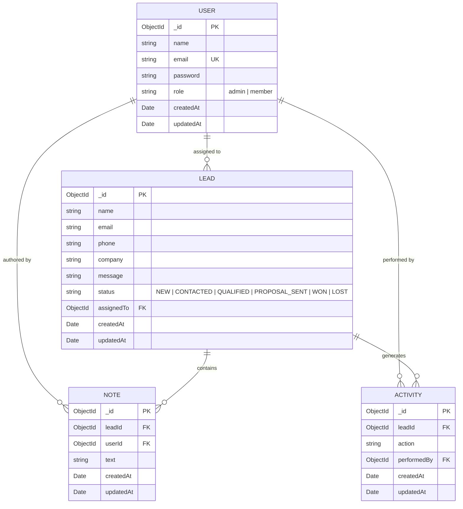
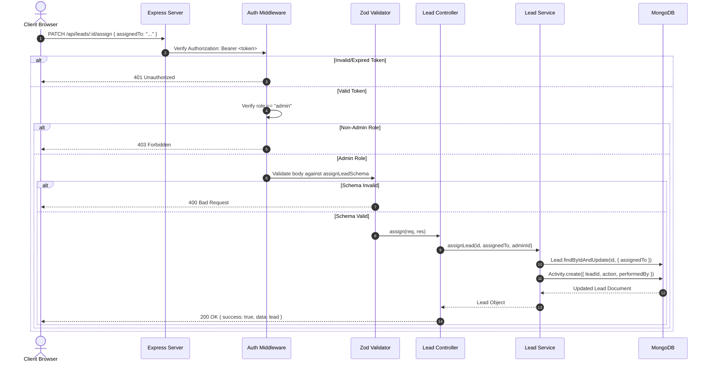

# System Architecture & Design

## Architectural Pattern Overview
Digital Heros is architected as a decoupled client-server web application with a 3-tier layered backend and a component-driven React single-page frontend.

```mermaid
graph TD
    Client["Browser / Client SPA (React 19 + React Router 7)"]
    API["Express 5 REST API (/api)"]
    DB[(MongoDB Atlas / Local)]

    Client -->|HTTP / JSON (Axios)| API
    API -->|Mongoose ODM| DB

    subgraph Server Layer
        Routes["Routes (auth, lead, note, activity, dashboard)"]
        Middleware["Middleware (auth, authorize, validate, CORS)"]
        Controllers["Controllers (HTTP transport, status codes)"]
        Services["Services (Business logic, transactions, audits)"]
        Models["Models (Mongoose Schemas & Types)"]

        Routes --> Middleware
        Middleware --> Controllers
        Controllers --> Services
        Services --> Models
    end
```

---

## Backend Layered Architecture (`server/`)

The server strictly segregates concerns across five dedicated architectural layers:

### 1. Routing Layer (`server/src/routes/`)
- Declarative Express routers grouping endpoints by resource domain:
  - `authRoutes.js`: Authentication (`/api/auth/register`, `/api/auth/login`, `/api/auth/me`, `/api/auth/logout`)
  - `leadRoutes.js`: Lead lifecycle (`/api/leads`, `/:id`, `/:id/status`, `/:id/assign`)
  - `noteRoutes.js`: Note collaboration (`/api/leads/:id/notes`, `/api/notes/:id`)
  - `activityRoutes.js`: Audit trail (`/api/leads/:id/activities`)
  - `dashboardRoutes.js`: Metrics and summary aggregations (`/api/dashboard`)
- Attaches middleware pipelines before passing control to controllers.

### 2. Middleware Layer (`server/src/middleware/`)
- **`authMiddleware.js` (`authenticate`)**:
  - Extracts Bearer token from `Authorization` header.
  - Verifies token with HMAC secret using `jsonwebtoken`.
  - Attaches authenticated user context to `req.user = { id: decoded.userId, role: decoded.role }`.
- **`authorize.js` (`authorize(...roles)`)**:
  - Enforces Role-Based Access Control (RBAC).
  - Validates `req.user.role` against permitted roles; rejects with `403 Forbidden` if unauthorized.
- **`validate.js` (`validate(schema)`)**:
  - Executes Zod schema parse on `req.body`.
  - Halts execution and returns `400 Bad Request` with structured error array on schema violation.

### 3. Controller Layer (`server/src/controllers/`)
- Acts as HTTP transport adapter.
- Responsible for parsing request query parameters, URL params, and body data.
- Invokes corresponding service methods.
- Maps service results to HTTP status codes (`200 OK`, `201 Created`, `400 Bad Request`, `404 Not Found`, `500 Server Error`).
- Formats uniform JSON responses.

### 4. Service Layer (`server/src/services/`)
- Contains pure business logic, database queries, and multi-model coordination.
- Decoupled from Express `req` and `res` objects.
- Automatically handles side-effects (e.g. `leadService` calls `createActivity` whenever a lead is updated, assigned, or deleted).
- Uses MongoDB Aggregation Framework for multi-stage queries (e.g. `dashboardService` calculates leads assigned per user and monthly trends).

### 5. Data Model Layer (`server/src/models/`)
- Mongoose schemas defining data types, required constraints, references, and automatic `timestamps: true` (`createdAt`, `updatedAt`).

---

## Data Models & Schema Design



### Lead Pipeline States
Leads progress strictly through standard status values:
1. `NEW` (Default upon submission)
2. `CONTACTED`
3. `QUALIFIED`
4. `PROPOSAL_SENT`
5. `WON`
6. `LOST`

---

## Frontend Architecture (`client/`)

### Application Shell & Layout
- **Component**: `Shell` in `client/src/pages/CrmPages.jsx`.
- Provides the persistent navigation sidebar:
  - Brand header (`HeroCRM`)
  - Navigation links: Overview (`/dashboard`), Leads (`/leads`), New Lead (`/leads/new`)
  - User profile preview (avatar initial, full name, role badge)
  - Logout action trigger
- Surrounds the dynamic `<main className="workspace">` content area.

### Authentication & Routing Guard
- **Component**: `RequireAuth` in `client/src/pages/CrmPages.jsx`.
- Evaluates `localStorage.getItem("token")`:
  - If present: renders child component.
  - If missing: redirects to `/login` via `<Navigate to="/login" replace />`.

### Client State Management
- No centralized external state library (Redux/Zustand) is used.
- State is managed locally within components:
  - `query` state in `Leads` handles page number, search term, status filter, and sort options with a 250ms debounce.
  - `localStorage` stores the session authentication token (`token`) and basic user metadata (`user`).
  - Mutations trigger manual reload functions (`load()` in `LeadDetails`) to refetch current server state.

---

## Request Lifecycle & Security Model


