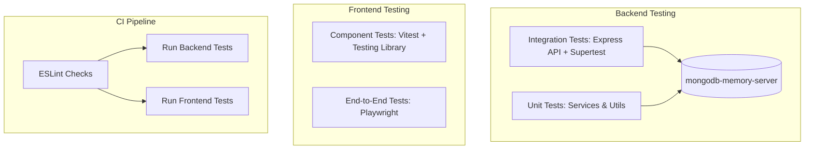

# Testing Strategy & Current Status

## Current Status: Zero Test Coverage

Across both `server` and `client`, there is currently **no automated test infrastructure or test execution setup**.

```text
Test Suites: 0
Total Tests: 0
Coverage:    0.00%
```

---

## Existing Test Artifacts & Configuration

### Backend (`server/`)
- `package.json` contains a default failing test script:
  ```json
  "scripts": {
    "test": "echo \"Error: no test specified\" && exit 1"
  }
  ```
- `server/src/tests/` directory exists in the tree but is completely empty (0 files).
- No testing framework dependencies are installed (neither `jest`, `vitest`, `mocha`, nor `supertest`).

### Frontend (`client/`)
- `package.json` does not declare any `test` script.
- No testing utilities are installed (neither `vitest`, `@testing-library/react`, `@testing-library/jest-dom`, nor `playwright`/`cypress`).
- Static linting exists (`npm run lint` via ESLint), but no unit, component, or end-to-end tests exist.

---

## Recommended Testing Architecture

To establish comprehensive test coverage and prevent regressions, the following setup is recommended:



---

## Priority Test Suites to Implement

### 1. Backend Integration Tests (`server/src/tests/`)
Recommended toolchain: `jest` or `vitest` + `supertest` + `mongodb-memory-server`.

- **Auth Suite (`auth.test.js`)**:
  - Registration: successful user creation, rejection on duplicate email, password hashing verification.
  - Login: correct credentials return JWT token and user payload; invalid credentials reject with 400.
  - Me endpoint: authenticated request returns current user info without password hash.
- **Lead Lifecycle Suite (`lead.test.js`)**:
  - Public lead submission without auth token.
  - Authenticated retrieval with pagination, filtering (`status`, `search`, `company`), and sorting.
  - Lead update, status transitions, and activity log generation.
  - Admin-only assignment and deletion (verifying 403 Forbidden for members).
- **Notes Suite (`note.test.js`)**:
  - Adding notes to existing leads.
  - Populating user details on note author.
  - Admin-only note deletion.
- **Dashboard Suite (`dashboard.test.js`)**:
  - Verification of metrics calculation across all pipeline states (`NEW`, `CONTACTED`, `QUALIFIED`, `PROPOSAL_SENT`, `WON`, `LOST`).
  - Monthly aggregation logic.

### 2. Frontend Component Tests (`client/src/`)
Recommended toolchain: `vitest` + `@testing-library/react` + `@testing-library/user-event`.

- **`LeadCapture.test.jsx`**: Public form validation, field formatting (10-digit phone restriction), submission loading states, success banner.
- **`RequireAuth.test.jsx`**: Redirects to `/login` when token is absent; renders children when token exists.
- **`Leads.test.jsx`**: Debounced search input, status select filtering, pagination buttons disabled at bounds.
- **`LeadDetails.test.jsx`**: Renders lead data, note addition form, activity timeline rendering.

---

## CI/CD Automation Plan

To ensure test reliability on pull requests and deployments:
1. Add `.github/workflows/ci.yml`.
2. Steps:
   - Check out code.
   - Setup Node.js (v20 LTS).
   - Install root and workspace dependencies (`npm run install:all`).
   - Run client linting (`npm run lint`).
   - Run server test suite (`npm --prefix server test`).
   - Run client test suite (`npm --prefix client test`).
   - Build client bundle (`npm run build`).
