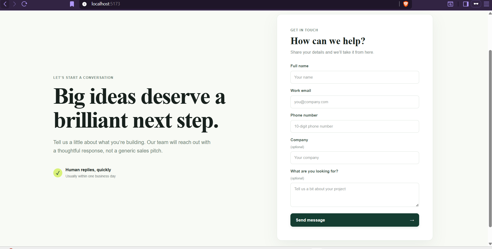
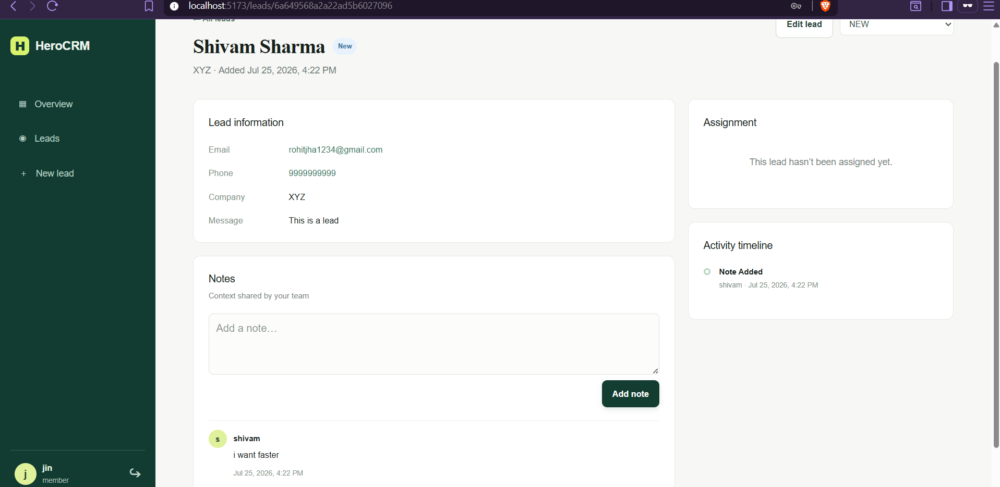
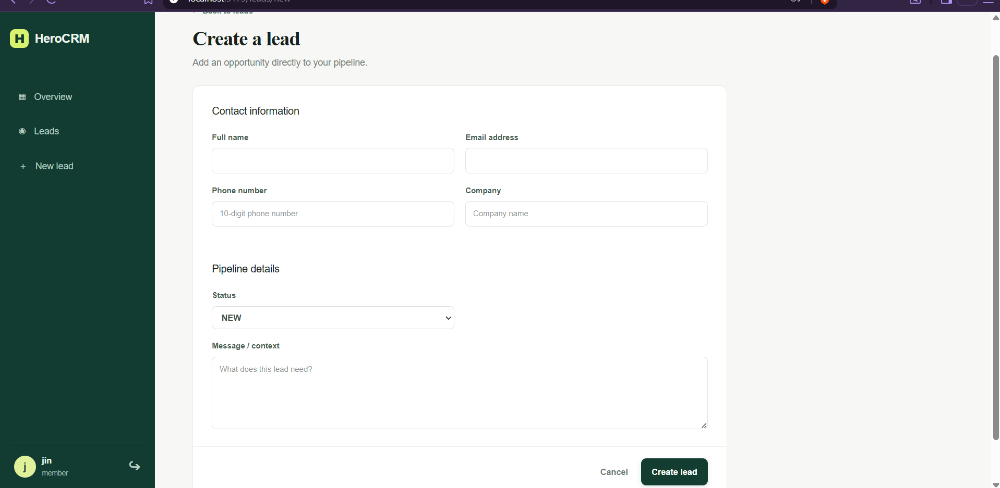
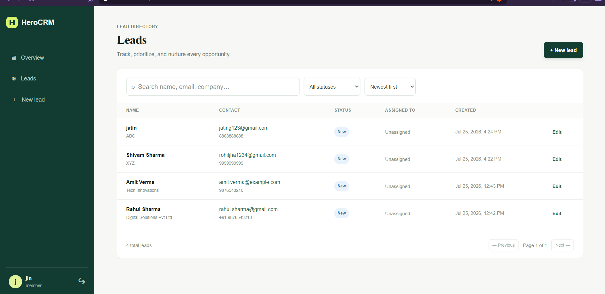

# Sales-Lead

A full-stack lead management app I built to keep lead capture, follow-ups, team ownership, notes, and activity history in one place.

The project has two main parts:

- A public lead capture page where anyone can submit their details
- A private CRM dashboard for managing leads with admin and member roles

## Live Project

Frontend: https://digital-h-mocha.vercel.app/

Backend API: https://heros-4vm4.onrender.com/

## Why I Built This

I wanted a practical CRM-style project that feels close to a real product: authentication, role-based access, lead lifecycle management, notes, activity tracking, filtering, pagination, and a deployed client/server setup.

It is built as my own full-stack project, with the goal of practicing clean API design, protected routes, MongoDB data modeling, and a simple dashboard workflow.

## Features

### Public Lead Capture

- Public form for collecting lead details
- Input validation
- Creates new leads directly from the website
- No login required for visitors

### Authentication

- JWT-based login
- Password hashing with bcrypt
- Protected dashboard routes
- Role-based permissions

### Roles

Admin users can:

- View all leads
- Create, edit, and delete leads
- Assign leads to team members
- Update lead status
- Add notes
- View activity history

Member users can:

- View assigned leads
- Update lead status
- Add notes
- View activity history

Member users cannot delete leads, assign leads, or access admin-only actions.

## Lead Pipeline

Leads move through this lifecycle:

```text
NEW
CONTACTED
QUALIFIED
PROPOSAL_SENT
WON / LOST
```

Every status change is saved in the activity history.

## Dashboard

The dashboard includes:

- Lead summary cards
- Recent activity
- Lead list
- Search
- Status filters
- Pagination
- Lead details
- Notes
- Assignment controls for admins

## Tech Stack

Frontend:

- React
- Vite
- Tailwind CSS
- React Router
- Axios
- Lucide React

Backend:

- Node.js
- Express.js
- MongoDB
- Mongoose
- JWT
- bcryptjs
- Zod validation

Deployment:

- Vercel for the client
- Render for the server
- MongoDB database

## Project Structure

```text
digital-heros
|-- client
|   |-- src
|   |-- public
|   |-- package.json
|   `-- vite.config.js
|
|-- server
|   |-- src
|   |   |-- config
|   |   |-- controllers
|   |   |-- middleware
|   |   |-- models
|   |   |-- routes
|   |   |-- services
|   |   |-- utils
|   |   `-- validations
|   `-- package.json
|
|-- screenshort
|-- package.json
`-- README.md
```

## Getting Started

### 1. Clone The Repo

```bash
git clone https://github.com/Shivam000189/digital-h
cd digital-h
```

### 2. Install Dependencies

Install everything from the root:

```bash
npm run install:all
```

Or install each app separately:

```bash
cd server
npm install

cd ../client
npm install
```

### 3. Configure The Server

Create `server/.env`:

```env
PORT=3000
MONGO_URI=mongodb://127.0.0.1:27017/dg-heros
JWT_SECRET=your_jwt_secret
CLIENT_URL=http://localhost:5173
```

### 4. Configure The Client

Create `client/.env`:

```env
VITE_API_URL=http://localhost:3000/api
```

### 5. Run Locally

Start the backend:

```bash
npm run dev:server
```

Start the frontend in another terminal:

```bash
npm run dev:client
```

The client runs on Vite, usually at:

```text
http://localhost:5173
```

## API Overview

Base URL:

```text
/api
```

### Auth

```text
POST /auth/register
POST /auth/login
GET  /auth/me
POST /auth/logout
```

Example login body:

```json
{
  "email": "shivam@test.com",
  "password": "123456"
}
```

Authenticated requests use:

```text
Authorization: Bearer <token>
```

### Leads

```text
POST   /leads
GET    /leads
GET    /leads/:id
PATCH  /leads/:id
PATCH  /leads/:id/status
PATCH  /leads/:id/assign
DELETE /leads/:id
```

Lead list supports:

```text
?page=1
?limit=10
?status=QUALIFIED
?assignedTo=userId
?search=john
```

### Notes

```text
POST   /leads/:id/notes
GET    /leads/:id/notes
DELETE /notes/:id
```

### Activity

```text
GET /leads/:id/activities
```

### Dashboard

```text
GET /dashboard
```

### Health Check

```text
GET /health
```

## Response Codes

| Code | Meaning |
| --- | --- |
| 200 | Success |
| 201 | Created |
| 400 | Bad request |
| 401 | Unauthorized |
| 403 | Forbidden |
| 404 | Not found |
| 500 | Server error |

## Test Credentials

Admin:

```text
Email: shivam@test.com
Password: 123456
```

Member:

```text
Email: member@example.com
Password: 123456
```

## Screenshots

### Public Lead Form



### Dashboard



### Leads



### Lead Details



## Future Ideas

- Email notifications for assigned leads
- CSV import and export
- Better analytics charts
- Lead reminders
- File attachments
- Live updates with WebSockets
- More detailed audit logs

## Author

Shivam Sharma

GitHub: https://github.com/Shivam000189/

X: https://x.com/shivam_s0
